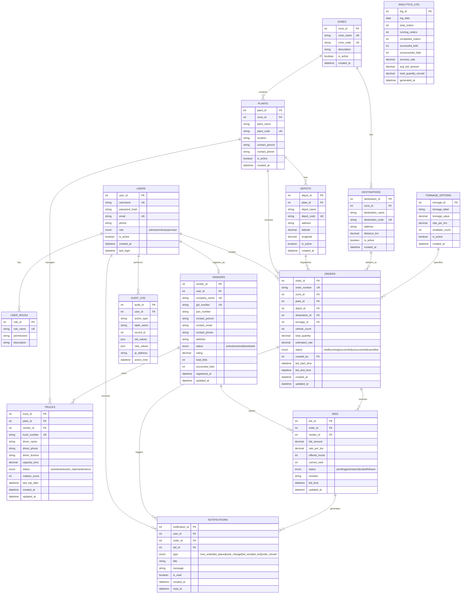
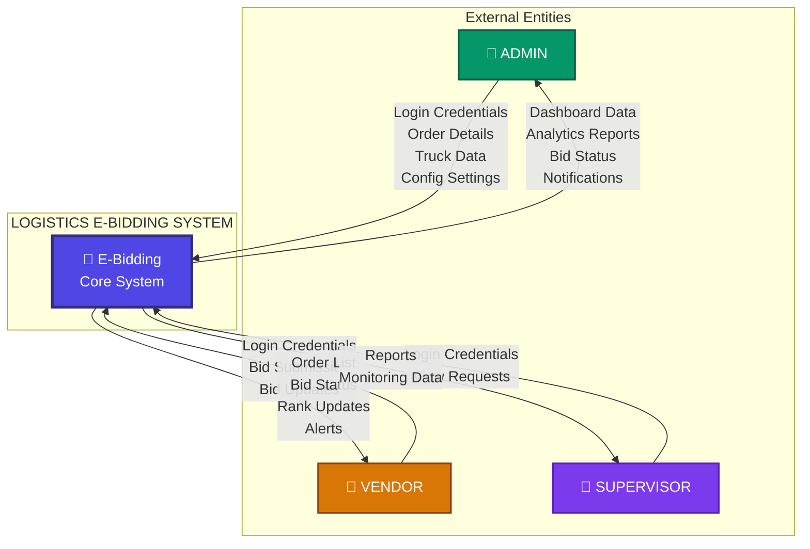
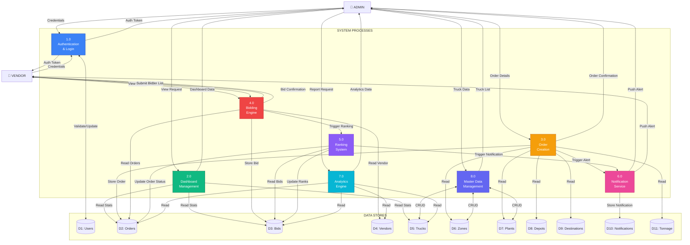
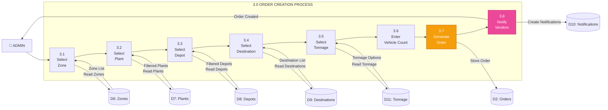
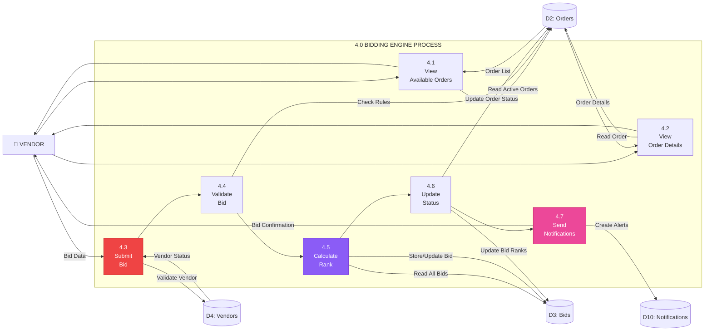
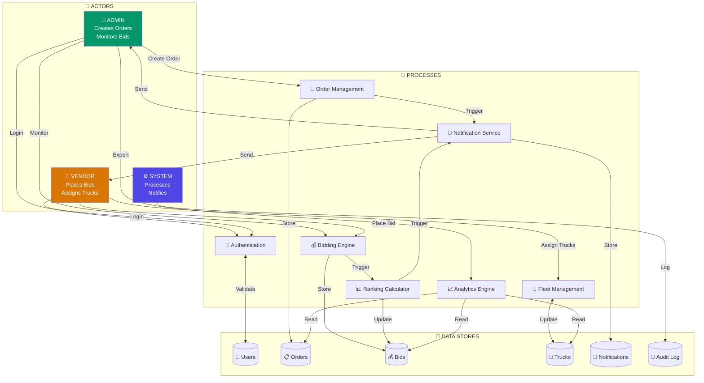
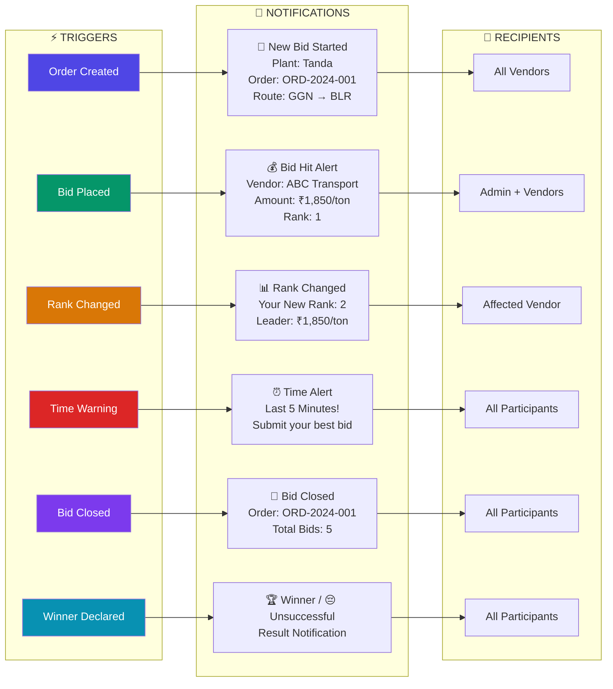
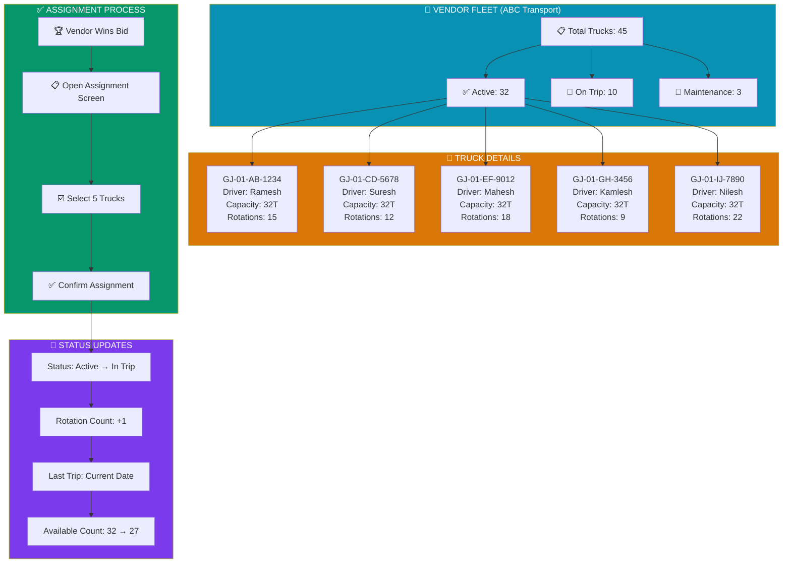

# Logistics E-Bidding System - Complete System Diagrams

> **Download Instructions**: Right-click on this file in the project sidebar → Download, or copy the Mermaid code sections to [Mermaid Live Editor](https://mermaid.live) to export as PNG/SVG/PDF.

---

## Table of Contents

1. [Entity Relationship (ER) Diagram](#1-entity-relationship-er-diagram)
2. [Data Flow Diagrams](#2-data-flow-diagrams)
3. [Use Case Diagram](#3-use-case-diagram)
4. [Appendix: SQL Schema](#4-appendix-sql-schema-generation)
5. [Complete End-to-End Workflow Diagram](#5-complete-end-to-end-workflow-diagram) ⭐ **NEW**
6. [Export & Download Instructions](#6-export--download-instructions)

---

## 1. Entity Relationship (ER) Diagram

### 1.1 Complete ER Diagram (Mermaid Code)



### 1.2 Entity Definitions Table

| Entity | Description | Primary Key | Foreign Keys |
|--------|-------------|-------------|--------------|
| **USERS** | System users (Admin, Vendor, Supervisor) | `user_id` | - |
| **USER_ROLES** | Role definitions and permissions | `role_id` | - |
| **ZONES** | Geographic zones for plant grouping | `zone_id` | - |
| **PLANTS** | Manufacturing/dispatch plants | `plant_id` | `zone_id` |
| **DEPOTS** | Storage depots within plants | `depot_id` | `plant_id` |
| **DESTINATIONS** | Delivery destinations | `destination_id` | `zone_id` |
| **TONNAGE_OPTIONS** | Available truck tonnage options | `tonnage_id` | - |
| **VENDORS** | Sub-carrier/transport vendors | `vendor_id` | `user_id` |
| **TRUCKS** | Fleet of trucks | `truck_id` | `plant_id`, `vendor_id` |
| **ORDERS** | Logistics orders for bidding | `order_id` | `zone_id`, `plant_id`, `depot_id`, `destination_id`, `tonnage_id`, `created_by` |
| **BIDS** | Vendor bids on orders | `bid_id` | `order_id`, `vendor_id` |
| **NOTIFICATIONS** | System notifications | `notification_id` | `user_id`, `order_id`, `bid_id` |
| **ANALYTICS_LOG** | Daily analytics snapshots | `log_id` | - |
| **AUDIT_LOG** | System audit trail | `audit_id` | `user_id` |

### 1.3 Relationship Matrix

| Relationship | Cardinality | Description |
|--------------|-------------|-------------|
| USERS → USER_ROLES | 1:N | User can have multiple roles |
| USERS → VENDORS | 1:1 | Vendor user has one vendor profile |
| USERS → ORDERS | 1:N | Admin creates multiple orders |
| USERS → NOTIFICATIONS | 1:N | User receives multiple notifications |
| ZONES → PLANTS | 1:N | Zone contains multiple plants |
| ZONES → DESTINATIONS | 1:N | Zone has multiple destinations |
| PLANTS → DEPOTS | 1:N | Plant has multiple depots |
| PLANTS → TRUCKS | 1:N | Plant manages multiple trucks |
| PLANTS → ORDERS | 1:N | Plant receives multiple orders |
| DEPOTS → ORDERS | 1:N | Depot dispatches multiple orders |
| DESTINATIONS → ORDERS | 1:N | Destination receives multiple orders |
| TONNAGE_OPTIONS → ORDERS | 1:N | Tonnage applies to multiple orders |
| VENDORS → TRUCKS | 1:N | Vendor owns multiple trucks |
| VENDORS → BIDS | 1:N | Vendor places multiple bids |
| ORDERS → BIDS | 1:N | Order receives multiple bids |
| ORDERS → NOTIFICATIONS | 1:N | Order triggers multiple notifications |
| BIDS → NOTIFICATIONS | 1:N | Bid generates notifications |

### 1.4 Attribute Details

#### USERS Entity
| Attribute | Type | Constraints | Description |
|-----------|------|-------------|-------------|
| user_id | INT | PK, AUTO_INCREMENT | Unique user identifier |
| username | VARCHAR(50) | UNIQUE, NOT NULL | Login username |
| password_hash | VARCHAR(255) | NOT NULL | Encrypted password |
| email | VARCHAR(100) | UNIQUE, NOT NULL | User email address |
| phone | VARCHAR(15) | NULL | Contact phone number |
| role | ENUM | NOT NULL | 'admin', 'vendor', 'supervisor' |
| is_active | BOOLEAN | DEFAULT TRUE | Account status |
| created_at | DATETIME | DEFAULT NOW() | Registration timestamp |
| last_login | DATETIME | NULL | Last login timestamp |

#### ORDERS Entity
| Attribute | Type | Constraints | Description |
|-----------|------|-------------|-------------|
| order_id | INT | PK, AUTO_INCREMENT | Unique order identifier |
| order_number | VARCHAR(20) | UNIQUE, NOT NULL | Human-readable order number |
| zone_id | INT | FK, NOT NULL | Reference to zone |
| plant_id | INT | FK, NOT NULL | Reference to plant |
| depot_id | INT | FK, NOT NULL | Reference to depot |
| destination_id | INT | FK, NOT NULL | Reference to destination |
| tonnage_id | INT | FK, NOT NULL | Reference to tonnage option |
| vehicle_count | INT | NOT NULL | Number of vehicles needed |
| total_quantity | DECIMAL(10,2) | COMPUTED | tonnage × vehicle_count |
| estimated_rate | DECIMAL(10,2) | NULL | Estimated rate per ton |
| status | ENUM | NOT NULL | Order status |
| created_by | INT | FK, NOT NULL | Admin who created order |
| bid_start_time | DATETIME | NOT NULL | Bidding window start |
| bid_end_time | DATETIME | NOT NULL | Bidding window end |
| created_at | DATETIME | DEFAULT NOW() | Creation timestamp |
| updated_at | DATETIME | ON UPDATE NOW() | Last update timestamp |

#### BIDS Entity
| Attribute | Type | Constraints | Description |
|-----------|------|-------------|-------------|
| bid_id | INT | PK, AUTO_INCREMENT | Unique bid identifier |
| order_id | INT | FK, NOT NULL | Reference to order |
| vendor_id | INT | FK, NOT NULL | Reference to vendor |
| bid_amount | DECIMAL(12,2) | NOT NULL | Total bid amount |
| rate_per_ton | DECIMAL(8,2) | NOT NULL | Rate per ton offered |
| offered_trucks | INT | NOT NULL | Number of trucks offered |
| current_rank | INT | NULL | Current ranking position |
| status | ENUM | NOT NULL | Bid status |
| remarks | TEXT | NULL | Additional remarks |
| bid_time | DATETIME | DEFAULT NOW() | Bid submission time |
| updated_at | DATETIME | ON UPDATE NOW() | Last update time |

---

## 2. Data Flow Diagrams

### 2.1 Level 0 - Context Diagram



### 2.2 Level 1 - Detailed Data Flow Diagram



### 2.3 Level 2 - Order Creation Process Decomposition



### 2.4 Level 2 - Bidding Engine Process Decomposition



### 2.5 DFD Summary Table

| Level | Components | Description |
|-------|------------|-------------|
| **Level 0** | 3 External Entities, 1 System | Context diagram showing system boundaries |
| **Level 1** | 8 Processes, 11 Data Stores | Detailed process and data flow |
| **Level 2 (3.0)** | 8 Sub-processes | Order creation workflow |
| **Level 2 (4.0)** | 7 Sub-processes | Bidding engine workflow |

---

## 3. Use Case Diagram

### 3.1 Complete Use Case Diagram

```mermaid
flowchart TB
    %% Actors
    Admin["👤 ADMIN"]
    Vendor["👤 VENDOR"]
    System["⚙️ SYSTEM ENGINE"]

    subgraph SystemBoundary["🏢 LOGISTICS E-BIDDING SYSTEM"]

        subgraph Login["📋 LOGIN MODULE"]
            UC1["Admin Login"]
            UC2["Vendor Login"]
            UC3["Validate Credentials"]
            UC4["Load Dashboard"]
        end

        subgraph Dashboard["📊 DASHBOARD MODULE"]
            UC5["View Total Plants"]
            UC6["View Total Trucks"]
            UC7["View Available Trucks"]
            UC8["View Active Bids"]
            UC9["View Successful Bids"]
            UC10["Access Control Panel"]
            UC11["Access Truck Master"]
            UC12["Access Analytics"]
        end

        subgraph OrderCreation["📝 ORDER CREATION MODULE"]
            UC13["Select Zone"]
            UC14["Select Plant"]
            UC15["Select Depot"]
            UC16["Select Destination"]
            UC17["Select Tonnage"]
            UC18["Enter Vehicle Count"]
            UC19["Generate Order"]
            UC20["Create Order Record"]
            UC21["Notify Vendors"]
        end

        subgraph VendorBidding["💰 VENDOR BIDDING MODULE"]
            UC22["View New Orders"]
            UC23["View Order Details"]
            UC24["Place Bid"]
            UC25["Update Bid"]
            UC26["Cancel Bid"]
            UC27["Check Ranking"]
            UC28["Check Bid Status"]
            UC29["Calculate Rank"]
            UC30["Update Bid Status"]
        end

        subgraph EBiddingTable["📋 E-BIDDING TABLE MODULE"]
            UC31["View All Orders"]
            UC32["View Order Status"]
            UC33["View Vendor Bids"]
            UC34["Export to Excel"]
            UC35["Close Bidding"]
            UC36["Mark Order Successful"]
            UC37["Mark Order Unsuccessful"]
        end

        subgraph TruckMaster["🚛 TRUCK MASTER MODULE"]
            UC38["Add Truck"]
            UC39["Edit Truck"]
            UC40["Delete Truck"]
            UC41["Change Truck Status"]
            UC42["Update Rotation Count"]
            UC43["Sync Truck Availability"]
        end

        subgraph Notifications["🔔 NOTIFICATION MODULE"]
            UC44["Send New Order Alert"]
            UC45["Send Bid Placed Alert"]
            UC46["Send Rank Change Alert"]
            UC47["Send Bid Won Alert"]
            UC48["Send Bid Lost Alert"]
            UC49["Log Notifications"]
            UC50["View Notification List"]
            UC51["Receive Notifications"]
        end

        subgraph Analytics["📈 ANALYTICS MODULE"]
            UC52["View Total Orders"]
            UC53["View Running Orders"]
            UC54["View Completed Orders"]
            UC55["View Successful Bids"]
            UC56["View Vendor Performance"]
            UC57["View Daily Graphs"]
            UC58["View Monthly Graphs"]
            UC59["Download Reports"]
            UC60["Update Metrics"]
        end

    end

    %% Admin Connections
    Admin --> UC1
    Admin --> UC5
    Admin --> UC6
    Admin --> UC7
    Admin --> UC8
    Admin --> UC9
    Admin --> UC10
    Admin --> UC11
    Admin --> UC12
    Admin --> UC13
    Admin --> UC31
    Admin --> UC32
    Admin --> UC33
    Admin --> UC34
    Admin --> UC35
    Admin --> UC36
    Admin --> UC37
    Admin --> UC38
    Admin --> UC39
    Admin --> UC40
    Admin --> UC41
    Admin --> UC42
    Admin --> UC50
    Admin --> UC52
    Admin --> UC53
    Admin --> UC54
    Admin --> UC55
    Admin --> UC56
    Admin --> UC57
    Admin --> UC58
    Admin --> UC59

    %% Vendor Connections
    Vendor --> UC2
    Vendor --> UC22
    Vendor --> UC23
    Vendor --> UC24
    Vendor --> UC25
    Vendor --> UC26
    Vendor --> UC27
    Vendor --> UC28
    Vendor --> UC51

    %% System Connections
    System --> UC3
    System --> UC4
    System --> UC20
    System --> UC21
    System --> UC29
    System --> UC30
    System --> UC43
    System --> UC44
    System --> UC45
    System --> UC46
    System --> UC47
    System --> UC48
    System --> UC49
    System --> UC60

    %% Include Relationships
    UC1 -.->|"«include»"| UC3
    UC2 -.->|"«include»"| UC3
    UC3 -.->|"«include»"| UC4
    UC19 -.->|"«include»"| UC20
    UC20 -.->|"«include»"| UC21
    UC24 -.->|"«include»"| UC29
    UC29 -.->|"«include»"| UC30

    %% Extend Relationships
    UC25 -.->|"«extend»"| UC24
    UC26 -.->|"«extend»"| UC24
    UC36 -.->|"«extend»"| UC35
    UC37 -.->|"«extend»"| UC35

    style Login fill:#3B82F6,stroke:#1E40AF,color:#fff
    style Dashboard fill:#10B981,stroke:#065F46,color:#fff
    style OrderCreation fill:#F59E0B,stroke:#B45309,color:#fff
    style VendorBidding fill:#EF4444,stroke:#B91C1C,color:#fff
    style EBiddingTable fill:#8B5CF6,stroke:#6D28D9,color:#fff
    style TruckMaster fill:#06B6D4,stroke:#0E7490,color:#fff
    style Notifications fill:#EC4899,stroke:#BE185D,color:#fff
    style Analytics fill:#6366F1,stroke:#4338CA,color:#fff
```



### 3.2 Use Case Specifications

#### UC19: Generate Order (Primary Use Case)

| Attribute | Description |
|-----------|-------------|
| **Use Case ID** | UC19 |
| **Use Case Name** | Generate Order |
| **Actor** | Admin |
| **Description** | Admin creates a new logistics order for vendor bidding |
| **Preconditions** | Admin is logged in; Zone, Plant, Depot, Destination are selected |
| **Postconditions** | Order is created; Vendors are notified |
| **Main Flow** | 1. Admin selects zone → 2. Selects plant → 3. Selects depot → 4. Selects destination → 5. Selects tonnage → 6. Enters vehicle count → 7. Clicks "Start" → 8. System creates order → 9. System notifies vendors |
| **Alternative Flow** | If any selection is invalid, show error message |
| **Includes** | UC20 (Create Order Record), UC21 (Notify Vendors) |

#### UC24: Place Bid (Primary Use Case)

| Attribute | Description |
|-----------|-------------|
| **Use Case ID** | UC24 |
| **Use Case Name** | Place Bid |
| **Actor** | Vendor |
| **Description** | Vendor submits a bid for an active order |
| **Preconditions** | Vendor is logged in; Order is in "Running" status |
| **Postconditions** | Bid is recorded; Rank is calculated; Status is updated |
| **Main Flow** | 1. Vendor views order details → 2. Enters bid amount → 3. Enters trucks offered → 4. Submits bid → 5. System validates → 6. System calculates rank → 7. System updates status → 8. System sends confirmation |
| **Alternative Flow** | If bid validation fails, show error message |
| **Includes** | UC29 (Calculate Rank), UC30 (Update Bid Status) |
| **Extensions** | UC25 (Update Bid), UC26 (Cancel Bid) |

### 3.3 Actor-Use Case Matrix

| Module | Admin | Vendor | System |
|--------|:-----:|:------:|:------:|
| **Login** | ✓ Login | ✓ Login | ✓ Validate |
| **Dashboard** | ✓ Full Access | - | - |
| **Order Creation** | ✓ Create Orders | - | ✓ Process & Notify |
| **Vendor Bidding** | - | ✓ Place/Update Bids | ✓ Calculate/Update |
| **E-Bidding Table** | ✓ View/Manage | - | - |
| **Truck Master** | ✓ Full CRUD | - | ✓ Sync Availability |
| **Notifications** | ✓ View List | ✓ Receive | ✓ Send/Log All |
| **Analytics** | ✓ View/Download | - | ✓ Update Metrics |

### 3.4 Use Case Count Summary

| Module | Total Use Cases | Admin | Vendor | System |
|--------|-----------------|-------|--------|--------|
| Login | 4 | 1 | 1 | 2 |
| Dashboard | 8 | 8 | 0 | 0 |
| Order Creation | 9 | 7 | 0 | 2 |
| Vendor Bidding | 9 | 0 | 7 | 2 |
| E-Bidding Table | 7 | 7 | 0 | 0 |
| Truck Master | 6 | 5 | 0 | 1 |
| Notifications | 8 | 1 | 1 | 6 |
| Analytics | 9 | 8 | 0 | 1 |
| **TOTAL** | **60** | **37** | **9** | **14** |

---

## 4. Export & Download Instructions

### 4.1 Method 1: Download This File Directly

1. In the Lovable project sidebar, locate `docs/SYSTEM_DIAGRAMS.md`
2. Right-click on the file
3. Select **"Download"**
4. Save to your local system

### 4.2 Method 2: Export Diagrams as Images (PNG/SVG)

#### Using Mermaid Live Editor:

1. Go to [https://mermaid.live](https://mermaid.live)
2. Copy the Mermaid code block (everything between ` ```mermaid ` and ` ``` `)
3. Paste into the editor
4. Click **"Actions"** → **"PNG"** or **"SVG"** to download

#### Example - Exporting ER Diagram:
```
1. Copy the erDiagram code from Section 1.1
2. Paste at mermaid.live
3. Download as PNG/SVG
```

### 4.3 Method 3: Export as PDF

#### Option A - Browser Print:
1. Open this file in preview mode
2. Press `Ctrl/Cmd + P`
3. Select "Save as PDF"
4. Click Save

#### Option B - Using Mermaid CLI:
```bash
npm install -g @mermaid-js/mermaid-cli
mmdc -i SYSTEM_DIAGRAMS.md -o diagrams.pdf
```

### 4.4 Method 4: Import to Diagramming Tools

#### Draw.io / Diagrams.net:
1. Export diagram as SVG from Mermaid Live Editor
2. Open [https://app.diagrams.net](https://app.diagrams.net)
3. File → Import → Select your SVG file
4. Edit as needed

#### Lucidchart:
1. Export as PNG from Mermaid Live Editor
2. In Lucidchart, use "Insert Image"
3. Trace over for editable version

### 4.5 Method 5: Use in Documentation Tools

| Tool | Method |
|------|--------|
| **GitHub** | Paste Mermaid code directly - renders automatically |
| **Notion** | Use code block with "mermaid" language |
| **Confluence** | Use Mermaid plugin or embed images |
| **GitBook** | Native Mermaid support in code blocks |
| **VS Code** | Use "Markdown Preview Mermaid Support" extension |

### 4.6 Quick Reference: Diagram File Formats

| Format | Best For | How to Get |
|--------|----------|------------|
| **PNG** | Presentations, Emails | Mermaid Live → Download PNG |
| **SVG** | Scalable graphics, Print | Mermaid Live → Download SVG |
| **PDF** | Documentation, Reports | Browser Print → Save as PDF |
| **MD** | Version control, Docs | Download this file directly |

---

## Appendix: SQL Schema Generation

If you need to create the database, here's the SQL schema:

```sql
-- Users Table
CREATE TABLE users (
    user_id SERIAL PRIMARY KEY,
    username VARCHAR(50) UNIQUE NOT NULL,
    password_hash VARCHAR(255) NOT NULL,
    email VARCHAR(100) UNIQUE NOT NULL,
    phone VARCHAR(15),
    role VARCHAR(20) NOT NULL CHECK (role IN ('admin', 'vendor', 'supervisor')),
    is_active BOOLEAN DEFAULT TRUE,
    created_at TIMESTAMP DEFAULT CURRENT_TIMESTAMP,
    last_login TIMESTAMP
);

-- Zones Table
CREATE TABLE zones (
    zone_id SERIAL PRIMARY KEY,
    zone_name VARCHAR(100) UNIQUE NOT NULL,
    zone_code VARCHAR(10) UNIQUE NOT NULL,
    description TEXT,
    is_active BOOLEAN DEFAULT TRUE,
    created_at TIMESTAMP DEFAULT CURRENT_TIMESTAMP
);

-- Plants Table
CREATE TABLE plants (
    plant_id SERIAL PRIMARY KEY,
    zone_id INTEGER REFERENCES zones(zone_id),
    plant_name VARCHAR(100) NOT NULL,
    plant_code VARCHAR(20) UNIQUE NOT NULL,
    location VARCHAR(255),
    contact_person VARCHAR(100),
    contact_phone VARCHAR(15),
    is_active BOOLEAN DEFAULT TRUE,
    created_at TIMESTAMP DEFAULT CURRENT_TIMESTAMP
);

-- Depots Table
CREATE TABLE depots (
    depot_id SERIAL PRIMARY KEY,
    plant_id INTEGER REFERENCES plants(plant_id),
    depot_name VARCHAR(100) NOT NULL,
    depot_code VARCHAR(20) UNIQUE NOT NULL,
    address TEXT,
    latitude DECIMAL(10, 8),
    longitude DECIMAL(11, 8),
    is_active BOOLEAN DEFAULT TRUE,
    created_at TIMESTAMP DEFAULT CURRENT_TIMESTAMP
);

-- Destinations Table
CREATE TABLE destinations (
    destination_id SERIAL PRIMARY KEY,
    zone_id INTEGER REFERENCES zones(zone_id),
    destination_name VARCHAR(100) NOT NULL,
    destination_code VARCHAR(20) UNIQUE NOT NULL,
    address TEXT,
    distance_km DECIMAL(10, 2),
    is_active BOOLEAN DEFAULT TRUE,
    created_at TIMESTAMP DEFAULT CURRENT_TIMESTAMP
);

-- Tonnage Options Table
CREATE TABLE tonnage_options (
    tonnage_id SERIAL PRIMARY KEY,
    tonnage_label VARCHAR(20) NOT NULL,
    tonnage_value DECIMAL(5, 2) NOT NULL,
    rate_per_km DECIMAL(8, 2),
    available_count INTEGER DEFAULT 0,
    is_active BOOLEAN DEFAULT TRUE,
    created_at TIMESTAMP DEFAULT CURRENT_TIMESTAMP
);

-- Vendors Table
CREATE TABLE vendors (
    vendor_id SERIAL PRIMARY KEY,
    user_id INTEGER REFERENCES users(user_id),
    company_name VARCHAR(200) UNIQUE NOT NULL,
    gst_number VARCHAR(20) UNIQUE,
    pan_number VARCHAR(15),
    contact_person VARCHAR(100),
    contact_email VARCHAR(100),
    contact_phone VARCHAR(15),
    address TEXT,
    status VARCHAR(20) DEFAULT 'active' CHECK (status IN ('active', 'inactive', 'blacklisted')),
    rating DECIMAL(3, 2) DEFAULT 0,
    total_bids INTEGER DEFAULT 0,
    successful_bids INTEGER DEFAULT 0,
    registered_at TIMESTAMP DEFAULT CURRENT_TIMESTAMP,
    updated_at TIMESTAMP DEFAULT CURRENT_TIMESTAMP
);

-- Trucks Table
CREATE TABLE trucks (
    truck_id SERIAL PRIMARY KEY,
    plant_id INTEGER REFERENCES plants(plant_id),
    vendor_id INTEGER REFERENCES vendors(vendor_id),
    truck_number VARCHAR(20) UNIQUE NOT NULL,
    driver_name VARCHAR(100),
    driver_phone VARCHAR(15),
    driver_license VARCHAR(30),
    capacity_tons DECIMAL(5, 2),
    status VARCHAR(20) DEFAULT 'active' CHECK (status IN ('active', 'inactive', 'on_trip', 'maintenance')),
    rotation_count INTEGER DEFAULT 0,
    last_trip_date TIMESTAMP,
    created_at TIMESTAMP DEFAULT CURRENT_TIMESTAMP,
    updated_at TIMESTAMP DEFAULT CURRENT_TIMESTAMP
);

-- Orders Table
CREATE TABLE orders (
    order_id SERIAL PRIMARY KEY,
    order_number VARCHAR(20) UNIQUE NOT NULL,
    zone_id INTEGER REFERENCES zones(zone_id),
    plant_id INTEGER REFERENCES plants(plant_id),
    depot_id INTEGER REFERENCES depots(depot_id),
    destination_id INTEGER REFERENCES destinations(destination_id),
    tonnage_id INTEGER REFERENCES tonnage_options(tonnage_id),
    vehicle_count INTEGER NOT NULL,
    total_quantity DECIMAL(10, 2),
    estimated_rate DECIMAL(10, 2),
    status VARCHAR(20) DEFAULT 'draft' CHECK (status IN ('draft', 'running', 'successful', 'unsuccessful', 'cancelled')),
    created_by INTEGER REFERENCES users(user_id),
    bid_start_time TIMESTAMP,
    bid_end_time TIMESTAMP,
    created_at TIMESTAMP DEFAULT CURRENT_TIMESTAMP,
    updated_at TIMESTAMP DEFAULT CURRENT_TIMESTAMP
);

-- Bids Table
CREATE TABLE bids (
    bid_id SERIAL PRIMARY KEY,
    order_id INTEGER REFERENCES orders(order_id),
    vendor_id INTEGER REFERENCES vendors(vendor_id),
    bid_amount DECIMAL(12, 2) NOT NULL,
    rate_per_ton DECIMAL(8, 2) NOT NULL,
    offered_trucks INTEGER NOT NULL,
    current_rank INTEGER,
    status VARCHAR(20) DEFAULT 'pending' CHECK (status IN ('pending', 'active', 'won', 'lost', 'withdrawn')),
    remarks TEXT,
    bid_time TIMESTAMP DEFAULT CURRENT_TIMESTAMP,
    updated_at TIMESTAMP DEFAULT CURRENT_TIMESTAMP,
    UNIQUE(order_id, vendor_id)
);

-- Notifications Table
CREATE TABLE notifications (
    notification_id SERIAL PRIMARY KEY,
    user_id INTEGER REFERENCES users(user_id),
    order_id INTEGER REFERENCES orders(order_id),
    bid_id INTEGER REFERENCES bids(bid_id),
    type VARCHAR(30) NOT NULL CHECK (type IN ('new_order', 'bid_placed', 'rank_change', 'bid_won', 'bid_lost', 'order_closed')),
    title VARCHAR(200) NOT NULL,
    message TEXT,
    is_read BOOLEAN DEFAULT FALSE,
    created_at TIMESTAMP DEFAULT CURRENT_TIMESTAMP,
    read_at TIMESTAMP
);

-- Analytics Log Table
CREATE TABLE analytics_log (
    log_id SERIAL PRIMARY KEY,
    log_date DATE NOT NULL,
    total_orders INTEGER DEFAULT 0,
    running_orders INTEGER DEFAULT 0,
    completed_orders INTEGER DEFAULT 0,
    successful_bids INTEGER DEFAULT 0,
    unsuccessful_bids INTEGER DEFAULT 0,
    success_rate DECIMAL(5, 2) DEFAULT 0,
    avg_bid_amount DECIMAL(12, 2) DEFAULT 0,
    total_quantity_moved DECIMAL(12, 2) DEFAULT 0,
    generated_at TIMESTAMP DEFAULT CURRENT_TIMESTAMP
);

-- Indexes for Performance
CREATE INDEX idx_orders_status ON orders(status);
CREATE INDEX idx_orders_plant ON orders(plant_id);
CREATE INDEX idx_bids_order ON bids(order_id);
CREATE INDEX idx_bids_vendor ON bids(vendor_id);
CREATE INDEX idx_notifications_user ON notifications(user_id);
CREATE INDEX idx_trucks_plant ON trucks(plant_id);
```

---

## 5. Complete End-to-End Workflow Diagram

> **Real Example Used**: Tanda Cement Factory needs 5 trucks (32T) from Gurugram → Bangalore

### 5.1 Complete System Workflow (11 Phases)

```mermaid
flowchart TB
    subgraph Phase1["📱 PHASE 1: LOGIN & AUTHENTICATION"]
        A1["🌐 Open Login Page"] --> A2["✏️ Enter Username/Password"]
        A2 --> A3{"🔐 Validate Credentials"}
        A3 -->|"✅ Valid"| A4["🎫 Generate Auth Token"]
        A3 -->|"❌ Invalid"| A5["⚠️ Show Error Message"]
        A5 --> A2
    end

    subgraph Phase2["📊 PHASE 2: ADMIN DASHBOARD"]
        B1["📈 Load Dashboard Metrics"]
        B2["📋 Running Orders: 12"]
        B3["✅ Completed Today: 8"]
        B4["🚛 Active Trucks: 156"]
        B5["💰 Today's Volume: 2,400 MT"]
        B1 --> B2 & B3 & B4 & B5
    end

    subgraph Phase3["📝 PHASE 3: ORDER CREATION"]
        direction TB
        C1["1️⃣ Select Zone: North"]
        C2["2️⃣ Select Plant: Tanda Cement Factory"]
        C3["3️⃣ Select Depot: Gurugram"]
        C4["4️⃣ Select Destination: Bangalore"]
        C5["5️⃣ Select Tonnage: 32T"]
        C6["6️⃣ Enter Vehicles: 5 Trucks"]
        C7["7️⃣ Click 'Start Bidding'"]
        C8["✨ Generate Order ID: ORD-2024-001"]
        C1 --> C2 --> C3 --> C4 --> C5 --> C6 --> C7 --> C8
    end

    subgraph Phase4["🔔 PHASE 4: NOTIFICATION BROADCAST"]
        D1["📤 System Broadcasts Alert"]
        D2["👥 All Registered Vendors"]
        D3["📱 Push Notification Sent"]
        D4["📧 Email Alert Sent"]
        D5["🔔 In-App Notification"]
        D1 --> D2
        D2 --> D3 & D4 & D5
    end

    subgraph Phase5["👤 PHASE 5: VENDOR PORTAL"]
        E1["🏢 Vendor Dashboard"]
        E2["🏭 Plant Active: Tanda"]
        E3["🚛 Total Trucks: 45"]
        E4["✅ Available: 32"]
        E5["📊 Active Bids: 3"]
        E6["🏆 Success Rate: 78%"]
        E7["👁️ View Open Bids"]
        E1 --> E2 & E3 & E4 & E5 & E6
        E2 & E3 & E4 & E5 & E6 --> E7
    end

    subgraph Phase6["💰 PHASE 6: REAL-TIME BIDDING"]
        F1["📋 Open Bid: ORD-2024-001"]
        F2["📍 Gurugram → Bangalore"]
        F3["🚛 5 Trucks × 32T = 160 MT"]
        F4["⏰ Time Remaining: 45:00"]
        F5["✏️ Enter Bid Amount"]
        F6["📤 Submit Bid: ₹1,850/ton"]
        F7["🔄 Real-time Rank Update"]
        F1 --> F2 --> F3 --> F4 --> F5 --> F6 --> F7
    end

    subgraph Phase7["🖥️ PHASE 7: ADMIN MONITORING"]
        G1["📊 Live Bid Status Table"]
        G2["| Vendor | Price | Rank | Status |"]
        G3["| ABC Transport | ₹1,850 | 1 | Active |"]
        G4["| XYZ Logistics | ₹1,920 | 2 | Active |"]
        G5["| PQR Carriers | ₹1,980 | 3 | Active |"]
        G6["📥 Export to Excel"]
        G7["⏹️ Close Bid Button"]
        G1 --> G2 --> G3 --> G4 --> G5
        G1 --> G6 & G7
    end

    subgraph Phase8["⚡ PHASE 8: BID ALERTS"]
        H1["🔔 New Bid Alert"]
        H2["📊 Rank Change Alert"]
        H3["⏰ Last 5 Minutes Alert"]
        H4["⏰ Last 1 Minute Alert"]
        H5["🔴 Bid Closing Alert"]
        H1 --> H2 --> H3 --> H4 --> H5
    end

    subgraph Phase9["🏆 PHASE 9: WINNER DECLARATION"]
        I1["⏹️ Bid Closed"]
        I2["📊 Final Ranking Calculated"]
        I3["🥇 Winner: ABC Transport"]
        I4["💰 Winning Amount: ₹1,850/ton"]
        I5["🎉 Winner Notification Sent"]
        I6["😔 Unsuccessful Notifications"]
        I1 --> I2 --> I3 --> I4 --> I5 & I6
    end

    subgraph Phase10["🚛 PHASE 10: TRUCK ASSIGNMENT"]
        J1["📋 Winner Opens Assignment"]
        J2["🚛 Select 5 Trucks from Fleet"]
        J3["| GJ-01-AB-1234 | Driver: Ramesh |"]
        J4["| GJ-01-CD-5678 | Driver: Suresh |"]
        J5["| GJ-01-EF-9012 | Driver: Mahesh |"]
        J6["| GJ-01-GH-3456 | Driver: Kamlesh |"]
        J7["| GJ-01-IJ-7890 | Driver: Nilesh |"]
        J8["✅ Confirm Assignment"]
        J1 --> J2 --> J3 & J4 & J5 & J6 & J7 --> J8
    end

    subgraph Phase11["🚀 PHASE 11: DISPATCH & COMPLETION"]
        K1["🔄 Truck Status: Active → In Trip"]
        K2["🔢 Rotation Count +1"]
        K3["📍 GPS Tracking Enabled"]
        K4["🚛 Dispatch Begins"]
        K5["📊 Analytics Updated"]
        K6["📝 Audit Log Created"]
        K1 --> K2 --> K3 --> K4 --> K5 --> K6
    end

    %% Connections between phases
    A4 --> B1
    B1 --> C1
    C8 --> D1
    D3 & D4 & D5 --> E1
    E7 --> F1
    F7 --> G1
    G1 --> H1
    G7 --> I1
    I5 --> J1
    J8 --> K1

    %% Styling
    style Phase1 fill:#1E40AF,stroke:#1E3A8A,color:#fff
    style Phase2 fill:#047857,stroke:#065F46,color:#fff
    style Phase3 fill:#B45309,stroke:#92400E,color:#fff
    style Phase4 fill:#7C3AED,stroke:#6D28D9,color:#fff
    style Phase5 fill:#0891B2,stroke:#0E7490,color:#fff
    style Phase6 fill:#DC2626,stroke:#B91C1C,color:#fff
    style Phase7 fill:#4338CA,stroke:#3730A3,color:#fff
    style Phase8 fill:#DB2777,stroke:#BE185D,color:#fff
    style Phase9 fill:#059669,stroke:#047857,color:#fff
    style Phase10 fill:#D97706,stroke:#B45309,color:#fff
    style Phase11 fill:#0D9488,stroke:#0F766E,color:#fff
```



### 5.2 Simplified Linear Flow (One-Line Journey)


### 5.3 Data Flow Between Modules



### 5.4 Real Example Timeline

> **Order**: ORD-2024-001 | **Route**: Tanda Cement Factory (Gurugram → Bangalore) | **Requirement**: 5 Trucks × 32T = 160 MT

| Time | Phase | Actor | Action | Data |
|------|-------|-------|--------|------|
| 09:00 AM | Login | Admin | Opens login page | - |
| 09:00:15 | Login | Admin | Enters credentials | username: admin@tanda |
| 09:00:20 | Login | System | Validates & generates token | JWT Token |
| 09:01 AM | Dashboard | Admin | Views dashboard metrics | Running: 12, Completed: 8 |
| 09:05 AM | Order Creation | Admin | Selects Zone | North |
| 09:05:30 | Order Creation | Admin | Selects Plant | Tanda Cement Factory |
| 09:06 AM | Order Creation | Admin | Selects Depot | Gurugram |
| 09:06:30 | Order Creation | Admin | Selects Destination | Bangalore |
| 09:07 AM | Order Creation | Admin | Selects Tonnage | 32T |
| 09:07:30 | Order Creation | Admin | Enters Vehicle Count | 5 Trucks |
| 09:08 AM | Order Creation | Admin | Clicks "Start Bidding" | - |
| 09:08:01 | Order Creation | System | Generates Order ID | ORD-2024-001 |
| 09:08:02 | Notification | System | Broadcasts to all vendors | "New Bid Started" |
| 09:08:05 | Notification | Vendor A | Receives push notification | Order Details |
| 09:08:05 | Notification | Vendor B | Receives push notification | Order Details |
| 09:08:05 | Notification | Vendor C | Receives push notification | Order Details |
| 09:10 AM | Vendor Portal | Vendor A | Opens dashboard | Views metrics |
| 09:10:30 | Vendor Portal | Vendor A | Clicks "Open Bids" | Sees ORD-2024-001 |
| 09:12 AM | Bidding | Vendor A | Submits bid | ₹1,920/ton |
| 09:12:01 | Ranking | System | Calculates rank | Vendor A = Rank 1 |
| 09:12:02 | Notification | System | Sends bid alert | "New bid placed" |
| 09:15 AM | Bidding | Vendor B | Submits bid | ₹1,850/ton |
| 09:15:01 | Ranking | System | Recalculates ranks | B=Rank 1, A=Rank 2 |
| 09:15:02 | Notification | System | Rank change alert | Vendor A notified |
| 09:20 AM | Bidding | Vendor C | Submits bid | ₹1,980/ton |
| 09:20:01 | Ranking | System | Updates ranks | B=1, A=2, C=3 |
| 09:25 AM | Monitoring | Admin | Views live status table | 3 active bids |
| 09:30 AM | Monitoring | Admin | Exports to Excel | bid_report.xlsx |
| 09:45 AM | Alert | System | Last 5 minutes warning | "Bid closing soon" |
| 09:49 AM | Alert | System | Last 1 minute warning | "Final chance" |
| 09:50 AM | Close Bid | Admin | Clicks "Close Bid" | - |
| 09:50:01 | Winner | System | Declares Rank 1 winner | Vendor B wins |
| 09:50:02 | Notification | System | Winner notification | "You won ORD-2024-001" |
| 09:50:02 | Notification | System | Unsuccessful notifications | Vendors A & C |
| 09:55 AM | Assignment | Vendor B | Opens truck assignment | Views fleet |
| 09:56 AM | Assignment | Vendor B | Selects 5 trucks | GJ-01-AB-1234, etc. |
| 09:58 AM | Assignment | Vendor B | Confirms assignment | - |
| 09:58:01 | Fleet Update | System | Updates truck status | Active → In Trip |
| 09:58:02 | Fleet Update | System | Updates rotation count | +1 for each truck |
| 10:00 AM | Dispatch | Vendor B | Trucks leave depot | GPS tracking active |
| 10:00:01 | Analytics | System | Updates daily stats | Orders completed +1 |
| 10:00:02 | Audit | System | Creates audit log | Full history recorded |

### 5.5 Notification Types & Triggers



### 5.6 Fleet Management Flow



### 5.7 Summary Card (Quick Reference)

```
╔══════════════════════════════════════════════════════════════════════════════╗
║                    LOGISTICS E-BIDDING SYSTEM - COMPLETE JOURNEY             ║
╠══════════════════════════════════════════════════════════════════════════════╣
║                                                                              ║
║  📍 EXAMPLE: Tanda Cement Factory | Gurugram → Bangalore | 5 Trucks × 32T   ║
║                                                                              ║
╠══════════════════════════════════════════════════════════════════════════════╣
║                                                                              ║
║  🔐 LOGIN          →  📊 DASHBOARD     →  📝 CREATE ORDER                   ║
║     Admin logs in      View metrics        Select Zone, Plant, Depot,       ║
║     System validates   Running orders      Destination, Tonnage, Vehicles   ║
║                        Active trucks       Click "Start Bidding"            ║
║                                                                              ║
╠══════════════════════════════════════════════════════════════════════════════╣
║                                                                              ║
║  🔔 NOTIFY         →  👥 VENDOR PORTAL →  💰 BIDDING                        ║
║     Broadcast to       View dashboard      Submit bid amount                ║
║     all vendors        Check fleet         Real-time rank update            ║
║     Push + Email       Open bids list      Multiple vendors compete         ║
║                                                                              ║
╠══════════════════════════════════════════════════════════════════════════════╣
║                                                                              ║
║  🖥️ MONITOR        →  ⏹️ CLOSE BID     →  🏆 WINNER                         ║
║     Live status        Admin closes        Rank 1 = Winner                  ║
║     table view         bidding             Winner notified                  ║
║     Export Excel       Time alerts         Others get unsuccessful          ║
║                                                                              ║
╠══════════════════════════════════════════════════════════════════════════════╣
║                                                                              ║
║  🚛 ASSIGN TRUCKS  →  🚀 DISPATCH      →  ✅ COMPLETE                       ║
║     Select 5 trucks    Status: In Trip     Analytics updated                ║
║     Confirm assign     GPS tracking        Audit log created                ║
║     Update fleet       Rotation +1         Ready for next order             ║
║                                                                              ║
╚══════════════════════════════════════════════════════════════════════════════╝
```

---

## 6. Export & Download Instructions

### How to Download This File

| Method | Steps |
|--------|-------|
| **Direct Download** | Right-click on `docs/SYSTEM_DIAGRAMS.md` in the project sidebar → Select "Download" |
| **Copy to Local** | Open file → Select All (Ctrl+A) → Copy (Ctrl+C) → Paste in your local editor |
| **GitHub Export** | Push to GitHub → Download from repository |

### How to Convert Mermaid Diagrams to Images

#### Option 1: Mermaid Live Editor (Recommended)
1. Go to [https://mermaid.live](https://mermaid.live)
2. Copy any Mermaid code block (between \`\`\`mermaid and \`\`\`)
3. Paste into the editor
4. Click "Export" → Choose PNG, SVG, or PDF

#### Option 2: VS Code Extension
1. Install "Markdown Preview Mermaid Support" extension
2. Open this file in VS Code
3. Press Ctrl+Shift+V to preview
4. Right-click diagram → Save as PNG

#### Option 3: Online Tools
- [https://kroki.io](https://kroki.io) - API-based rendering
- [https://mermaid.ink](https://mermaid.ink) - Direct URL to image

### Recommended Export Formats

| Format | Best For |
|--------|----------|
| **PNG** | Presentations, documents, emails |
| **SVG** | Web pages, scalable graphics |
| **PDF** | Printing, formal documentation |

---

**Document Version:** 2.0  
**Last Updated:** 2024  
**System:** Logistics E-Bidding System  
**Real Example:** Tanda Cement Factory | Gurugram → Bangalore | 5 Trucks × 32T = 160 MT
